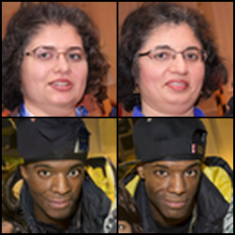
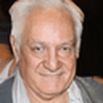

# pytorch-diffusion-autoencoder
WIP: Unofficial implementation of diffusion autoencoders, using pytorch (https://diff-ae.github.io/)

Special thanks for https://github.com/lucidrains/denoising-diffusion-pytorch and https://github.com/openai/guided-diffusion

# Samples




# Status
- [x] Models and train script
- [x] Sample from model
- [x] Interpolation
- [ ] latent diffusion
- [ ] attribute manipulation on real images

# pretrained models

* FFHQ_64: https://mega.nz/file/zI9QkDhb#kQdOP_taaXyVVdgS0rJa0QIa_JQQUZXnasM2Q7S57bM
# Usage

`python scripts/sample_diffusion_autoencoder.py \ 
--checkpoint-path=$PATH_TO_PREVIOUSLY_DOWNLOADED_CHECKPOINT \
--config-path =./config/ffhq_64_openai.yml \`


# Train your own

```
import torch
from model.diffusion import GaussianDiffusion
from model.openai.openai import UnetModel, EncoderUNetModel
from model.latent_encoder import LateEncoder

model = Unet(
        image_size=[28,28],
        in_channels=1,
        out_channels=1,
        model_channels=32,
        num_res_blocks=2,
        channel_mult=[1, 2],
        attention_resolutions=[],
        z_dim=256,
)

# almost same as the model. z_dim MUST be equals.
encoder = EncoderUNetModel(
        image_size=[28,28],
        in_channels=1,
        model_channels=32,
        num_res_blocks=2,
        channel_mult=[1, 2],
        attention_resolutions=[],
        pool= 'spatial_v2',
        z_dim=256,
    )

diffusion = AutoEncoderGaussianDiffusion(
    model,
    image_size = 28,
    timesteps = 1000,   # number of steps
    loss_type = 'l1',    # L1 or L2
    latent_encoder = encoder,
)

training_images = torch.randn(8, 1, 28, 28)
loss = diffusion(training_images)
loss.backward()
# after a lot of training

image = torch.randn(3, 1, 28, 28) 
result, latent = diffusion.p_sample_loop((1, model.in_channels, *model.size), image)
result.shape # (3, 1, 28, 28)
latent.shape # (3, 128)
```
